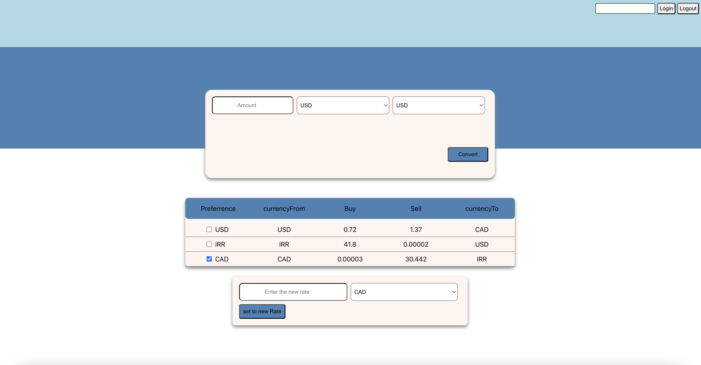

# Exchange Currency App (React, TypeScript, Node.js, Express)
## Key features
- Displayed exchange rates, including both buying and selling rates, between CAD, USD, and IRR currencies.
- Implemented secure login and logout functionalities.
- Enabled admin users to modify currency buying rates, based on their role permissions.
- Utilized cookies to retain users' preferred currency settings by default.
- Developed functionality to accurately convert specified amounts between different currencies.
# To run the app:
1. Install dependencies using: run npm install
2. Run the server using: npm run dev
3. Run run the client using: npm start
   

